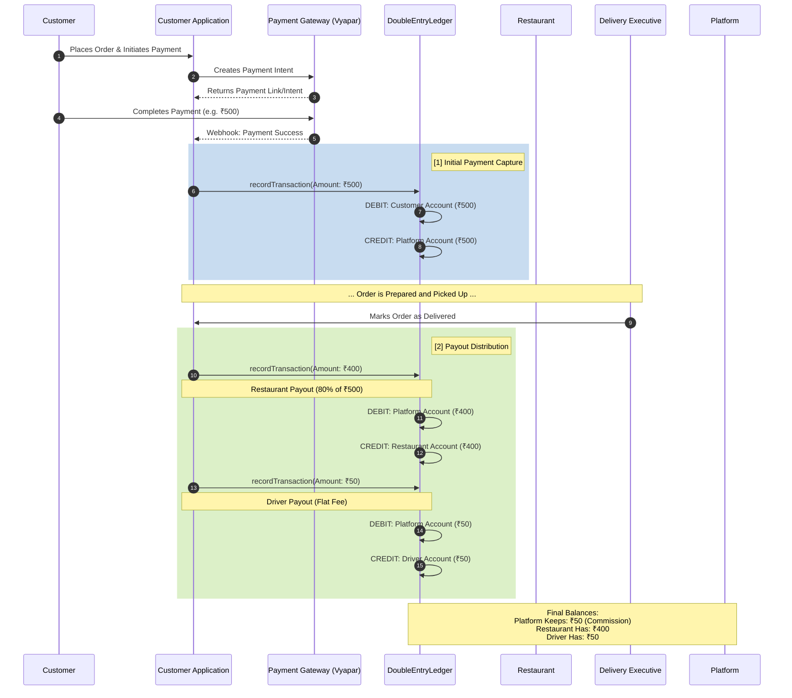

# Ledger Payout Flow

Currently, the exact payout logic (the percentage and flat fee) is **hardcoded in the application code**, not stored in a database or external configuration file. 

Specifically, you can find this logic in `PickedUpState.java` inside the `CustomerApplication`:
[PickedUpState.java](file:///Users/parthureddy/Documents/Food%20Delivery.nosync/CustomerApplication/src/main/java/com/fooddelivery/order/service/state/impl/PickedUpState.java#L26-L29)

```java
        // Ledger accounting
        BigDecimal total = order.getTotalAmount();
        BigDecimal restPayout = total.multiply(new BigDecimal("0.80")); // 80% to Restaurant
        BigDecimal driverPayout = new BigDecimal("50.00");              // Flat Rs 50 to Driver
```

Here is a detailed flow diagram showing how the funds move from the moment a customer pays to the moment the payouts are distributed.


